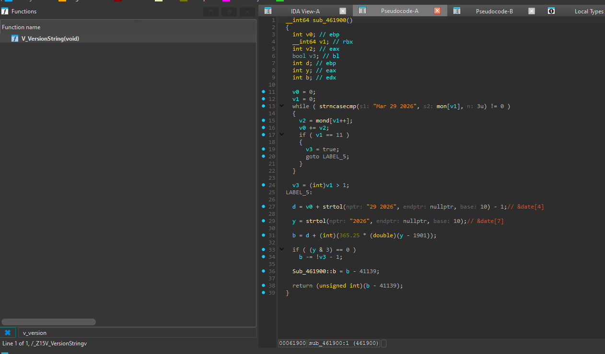
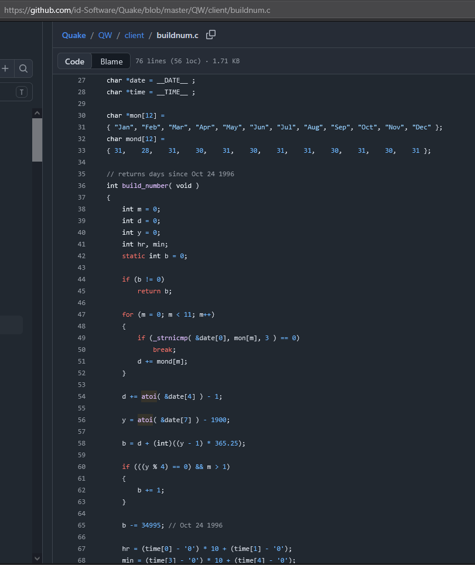
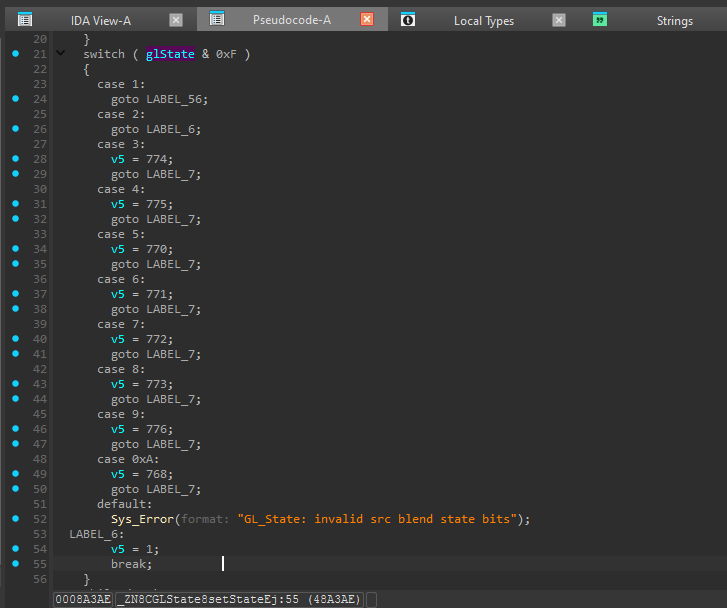
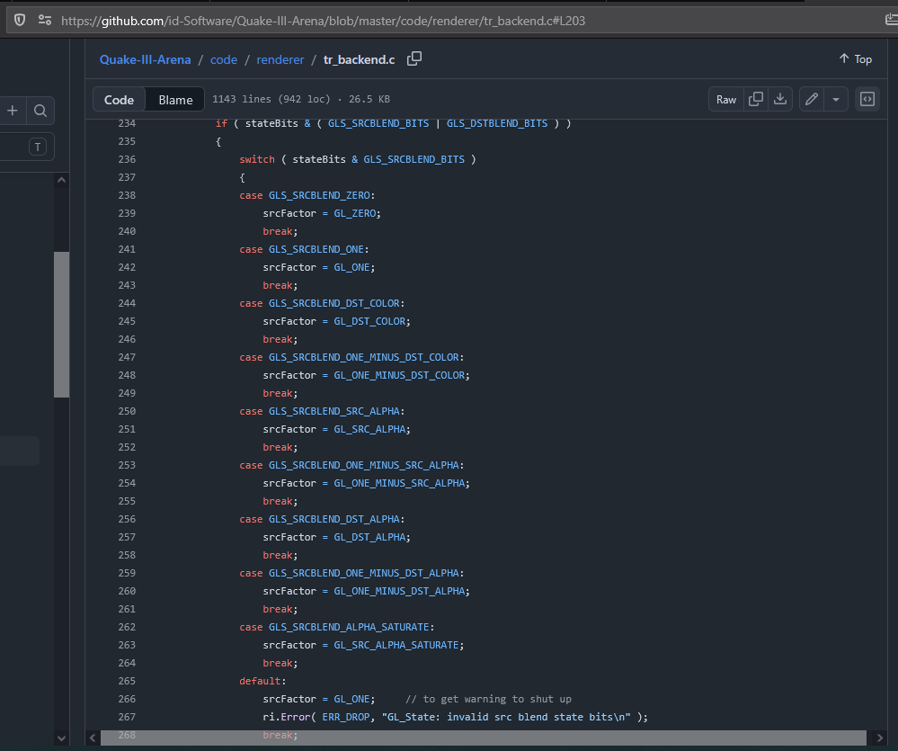
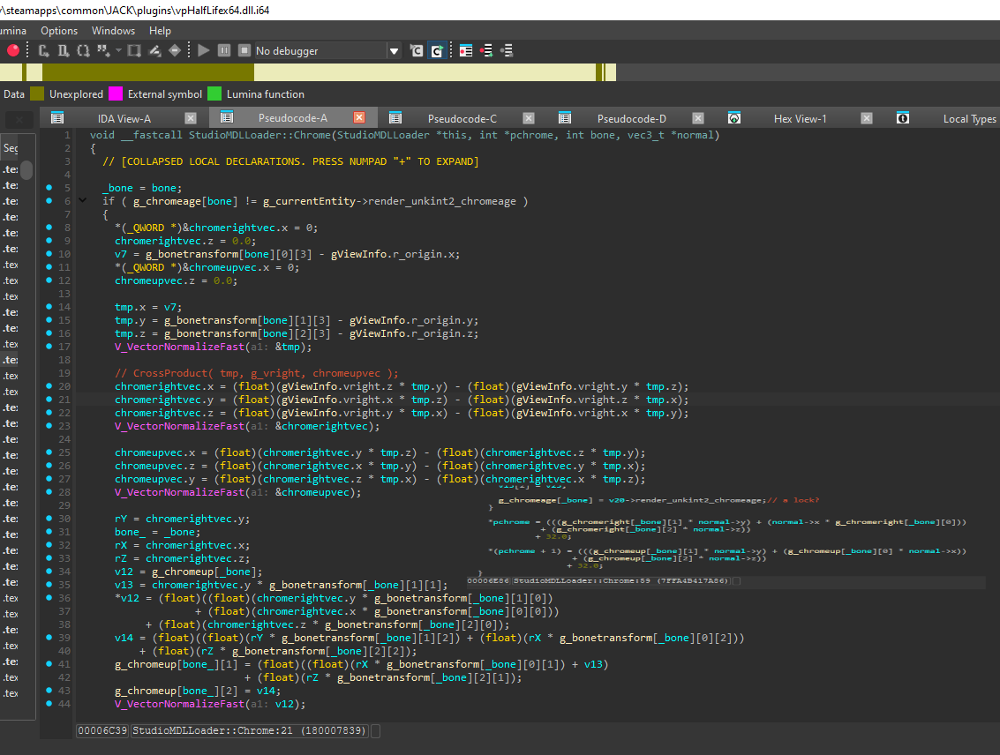
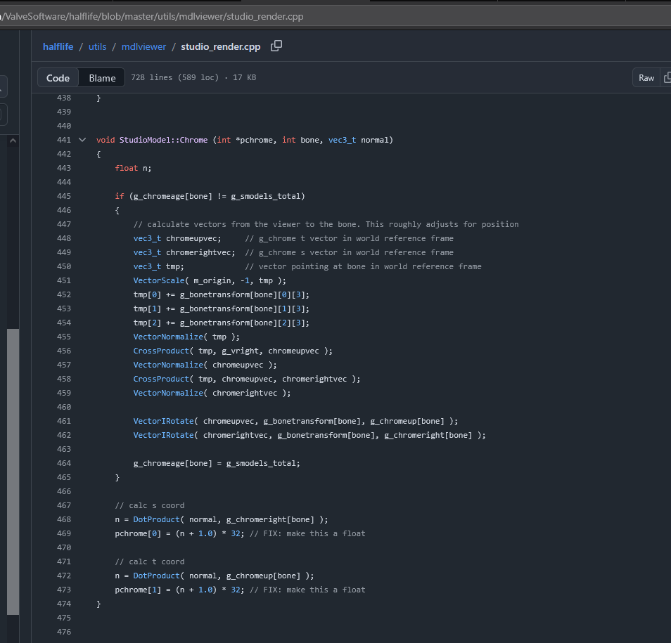

## Usage of Valve's leaked code and licensing issues inside the Steam version of J.A.C.K.
- All findings were done on the latest actual J.A.C.K. version 1.2.4603

### (Jack) CMapFace::InitializeTextureAxes -> CMapFace::calcTextureAxes
- Direct copy of leaked code.
- Almost 1 to 1 copy of texture axes calculation function.

### (vpHalfLife) BuildGammaTable (Unknown name) -> Quake BuildGammaTable
- Licensing issue.
- Function has the same behavior and uses the same gamma table calculation formula.

### (Jack) Almost identical copy of build_number function from QuakeWorld
- Licensing issue.
- Function uses the same constants, the same month table but it does not include build time.

### (Jack) Stolen GL_State function from Quake III Arena
- Licensing issue.
- Function uses the same constants, but it was extended a bit and it does not have a way to disable DEPTH_TEST.

### (vpHalfLife) StudioModel Chrome calculation function
- Licensing issue.
- Almost identical copy to StudioModel::Chrome function from Valve's HLMV.

