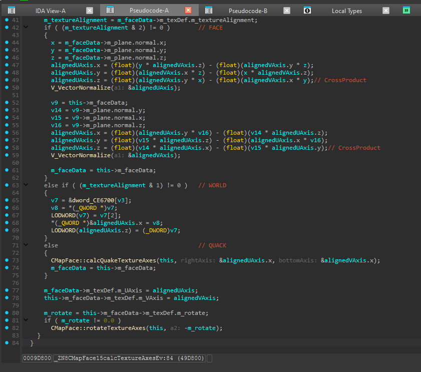
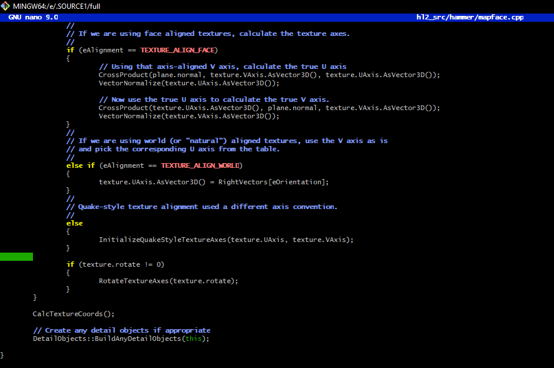
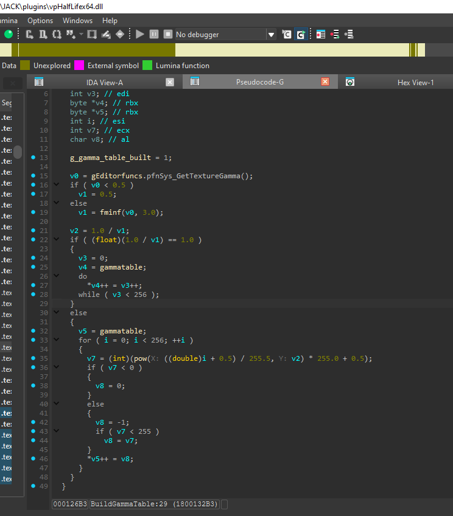
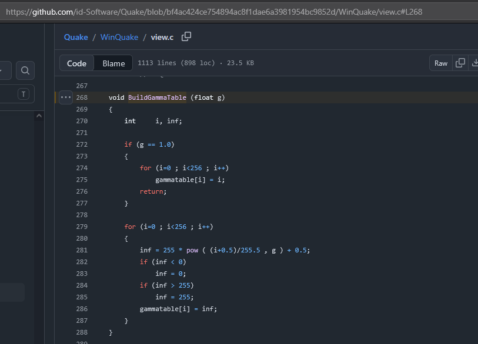

## Usage of the leaked Valve's code/licensing issues inside of the Steam version of J.A.C.K.
- All findings were done on the latest actual J.A.C.K. version 1.2.4603

### (Jack) CMapFace::calcTextureAxes -> CMapFace::InitializeTextureAxes
- Direct copy of leaked code.
- Almost 1 to 1 copy of texture axes calculation function.

### (vpHalfLife) BuildGammaTable (Unknown name) -> Quake BuildGammaTable
- Licensing issue.
- Function has the same behavior and uses the same gamma table calculation formula.

