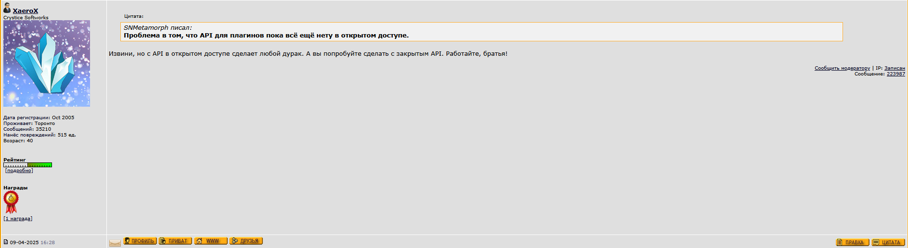

# J.A.C.K. Plugin SDK

Opensource Plugin SDK for [J.A.C.K. (prev. Jackhammer)](https://store.steampowered.com/app/496450/JACK/).

## Description
This is an unofficial Plugin SDK for J.A.C.K. level editor.

For various API examples, see [vpExamplePlugin](plugins/vpExamplePlugin) plugin source tree.

For some working plugin prototype you can check out [vpHalfLifeAlpha](plugins/vpHalfLifeAlpha) plugin source tree.

You can also take a look on [README.md](sdk/README.md) inside the `sdk` folder.

## Licensing
SDK Headers are licensed under the LGPL-2.1-or-later license; For more information about licensing see [LICENSE.md](LICENSE.md)

For some funny things found while creating this SDK, see [EVIDENCE.md](EVIDENCE.md) 