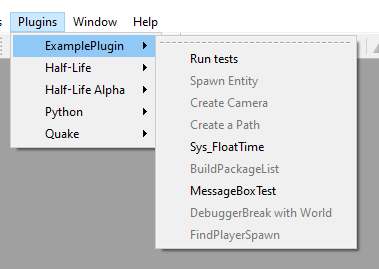
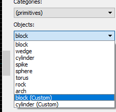

# vpExamplePlugin

This folder contains source code of the main example plugin for J.A.C.K.

## Features

- Overriding the "Half-Life / TFC" gameprofile with a custom one
- Support for loading almost any possible model format using Open Asset Import Library
- Support for loading custom sprite and texture formats using stb_image.h
- 2 custom primitives based on original reverse-engineered functions from the editor
- Janky .map parser (do not use it please, check out vpHalfLifeAlpha for a good one)
- Various Dialog API examples
- 10 custom menu actions with various api examples

## Screenshots

