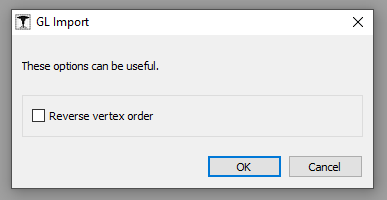
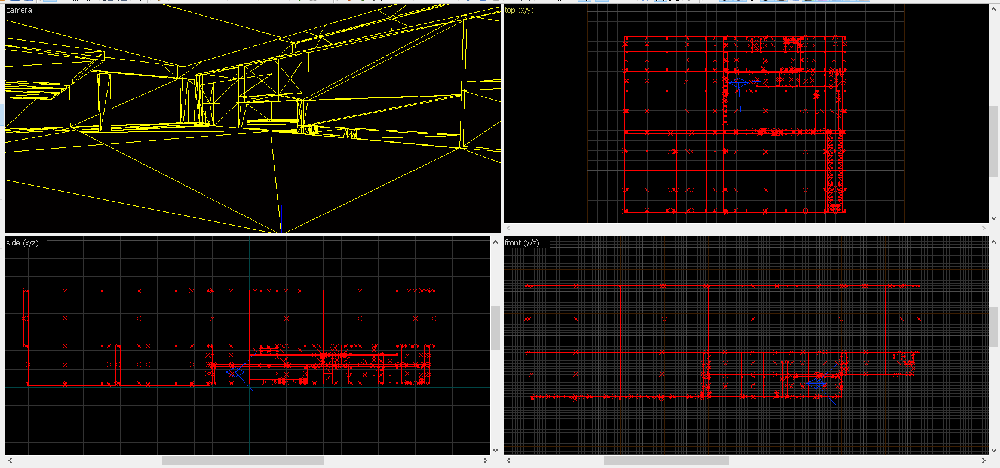

# vpGLView

This folder contains source code of the GLView plugin for J.A.C.K.

## Features

- Supports 3-point and 4-point (no displacements) vertices
- Can load simple `.gl` files generated by vbsp/q(hl)csg

## Screenshots

