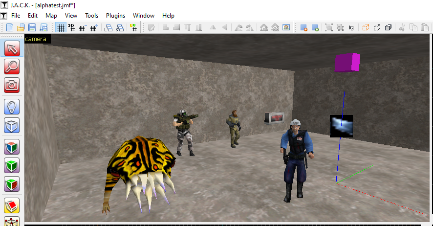
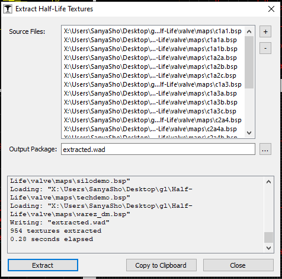

# vpHalfLifeAlpha

This folder contains source code of the Half-Life Alpha 0.52 support plugin for J.A.C.K.

## Features

- Has it's own gameprofile
- Supports importing and exporting maps in a Quake1 .map format (`( p0 ) ( p1 ) ( p2 ) texturename xshift yshift rotate scaleu scalev`)
- Loading studiomdlv6 (sequences, textures, lighting)
- Loading Valve's spritev1 format (shares the version with Q1 but each texture has palette information)
- BSP texture extraction tool (supports BSP29 with palette information inside)

## TODO

- [ ] RMF 1.4 serializer
- [ ] Proper StudioMDL bounding box calculation (currently it does not rotate with the entity)

## Screenshots

